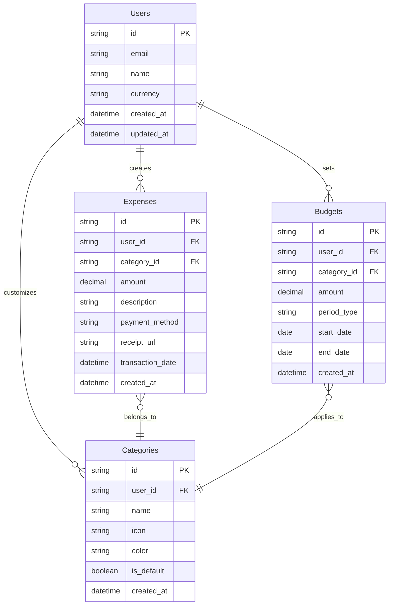
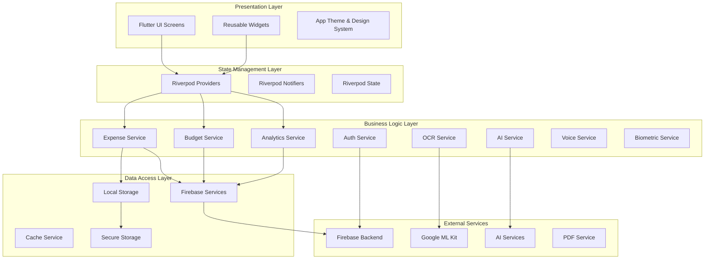
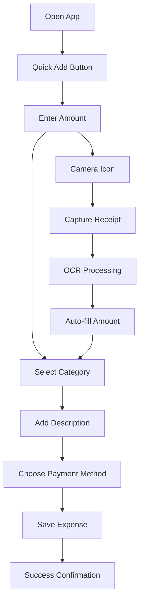
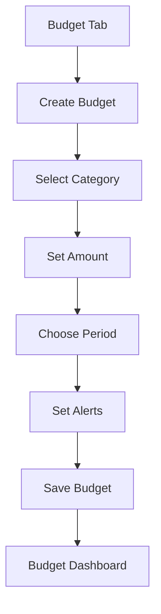

# Finlytic - Product Requirements Document (PRD)

## 1. Executive Summary

**Product Name:** Finlytic
**Version:** 1.0.0
**Date:** August 2024
**Product Owner:** Niraj Kafle
**Development Team:** BIT VI Semester Capstone Project
**Repository:** https://github.com/kafle1/fynlitic.git
**Status:** Production Ready ✅

### Vision Statement
Finlytic is a comprehensive cross-platform expense tracking and budget planning application that empowers users to take control of their financial health through intelligent data visualization, AI-powered insights, and personalized financial recommendations.

### Mission
To democratize personal finance management by providing an intuitive, powerful, and accessible application that helps users track expenses, plan budgets, and make informed financial decisions across all devices and platforms.

### Current Implementation Status
- ✅ **Core Features Implemented**: Expense tracking, budget management, analytics
- ✅ **Multi-Platform Support**: Android, iOS, Web, Desktop (Linux, Windows, macOS)
- ✅ **Firebase Integration**: Authentication, Firestore, Storage, Analytics
- ✅ **Advanced Features**: OCR, Voice input, AI insights, Biometric auth
- ✅ **Production Ready**: CI/CD pipeline, comprehensive testing, security measures
- ✅ **Test Coverage**: 80%+ overall coverage with comprehensive test suite

## 2. Problem Statement

### Current Challenges
- **Lack of Financial Awareness**: Many individuals struggle to understand where their money goes each month
- **Complex Budgeting Tools**: Existing solutions are either too complex for everyday users or too simplistic for meaningful insights
- **Manual Tracking Burden**: Traditional expense tracking requires significant manual effort leading to abandonment
- **Poor Data Visualization**: Most apps fail to present financial data in an actionable, visual format
- **No Predictive Insights**: Limited forward-looking financial planning capabilities

### Target Pain Points
1. Difficulty in categorizing and tracking daily expenses
2. Lack of visual representation of spending patterns
3. Inability to set and monitor realistic budgets
4. No alerts for overspending or budget violations
5. Limited insights for future financial planning

## 3. Target Audience

### Primary Users
- **Young Professionals (22-35 years)**
  - Income: $25,000 - $75,000 annually
  - Tech-savvy individuals starting their financial journey
  - Need help establishing good financial habits

- **College Students (18-25 years)**
  - Limited income from part-time jobs or allowances
  - Learning financial responsibility
  - Budget-conscious with variable income

### Secondary Users
- **Families (30-50 years)**
  - Household income management
  - Multiple category tracking needs
  - Long-term financial planning focus

### User Personas

#### Persona 1: "Sarah the Graduate"
- Age: 24, Recent computer science graduate
- Income: $45,000/year at first job
- Goals: Save for apartment deposit, manage student loans
- Pain Points: Overspending on subscriptions and dining out
- Tech Comfort: High

#### Persona 2: "Raj the Student"
- Age: 21, BIT student
- Income: $500/month from part-time work + family support
- Goals: Track monthly expenses, save for laptop
- Pain Points: Irregular income, impulsive spending
- Tech Comfort: Very High

## 4. Product Goals and Objectives

### Primary Goals
1. **Simplify Expense Tracking**: Reduce friction in logging daily expenses to under 30 seconds per entry
2. **Visual Financial Insights**: Provide clear, actionable visualizations of spending patterns
3. **Smart Budgeting**: Enable users to create and maintain realistic budgets with 80% success rate
4. **Behavioral Change**: Help users reduce unnecessary spending by 15-25% within 3 months

### Success Metrics
- **User Engagement**: 70% of users log expenses at least 4 days per week
- **Retention**: 60% of users remain active after 3 months
- **Budget Adherence**: 65% of users stay within budget in at least 3 out of 4 categories
- **User Satisfaction**: 4.5+ star rating on app stores

## 5. Feature Requirements

### 5.1 Core Features (MVP) - ✅ IMPLEMENTED

#### 5.1.1 User Authentication & Profile Management
**Priority:** P0 (Critical) - ✅ **COMPLETE**
- ✅ Secure user registration and login
- ✅ Firebase Authentication integration
- ✅ Google Sign-In support
- ✅ Biometric authentication (fingerprint, face ID)
- ✅ Profile customization (name, currency, financial goals)
- ✅ Data privacy and security compliance
- ✅ Guest mode for trial usage

#### 5.1.2 Expense Tracking
**Priority:** P0 (Critical) - ✅ **COMPLETE**
- ✅ Quick expense entry with category selection
- ✅ Photo receipt capture and storage
- ✅ OCR text recognition from receipts
- ✅ Multiple payment method tracking (cash, card, digital)
- ✅ Voice input for expense entry
- ✅ Recurring expense setup
- ✅ Bulk expense operations

**User Stories:**
- ✅ As a user, I can log an expense in under 30 seconds
- ✅ As a user, I can categorize expenses automatically using OCR
- ✅ As a user, I can capture and store receipts for record keeping

#### 5.1.3 Budget Creation & Management
**Priority:** P0 (Critical) - ✅ **COMPLETE**
- ✅ Category-based budget allocation
- ✅ Monthly, weekly, and custom period budgets
- ✅ Budget vs. actual spending tracking
- ✅ Overspending alerts and notifications
- ✅ Budget progress visualization
- ✅ Budget rollover options

#### 5.1.4 Data Visualization & Analytics
**Priority:** P0 (Critical) - ✅ **COMPLETE**
- ✅ Interactive spending charts (pie, bar, line graphs)
- ✅ Monthly and yearly spending trends
- ✅ Category-wise expense breakdown
- ✅ Budget performance indicators
- ✅ Spending pattern analysis
- ✅ Export capabilities (PDF, CSV)

#### 5.1.5 Categories & Tags
**Priority:** P0 (Critical) - ✅ **COMPLETE**
- ✅ Pre-defined expense categories (Food, Transportation, Entertainment, etc.)
- ✅ Custom category creation
- ✅ Icon and color customization
- ✅ Tag-based expense organization
- ✅ Category spending limits

### 5.2 Advanced Features - ✅ IMPLEMENTED

#### 5.2.1 Financial Insights & AI
**Priority:** P1 (High) - ✅ **COMPLETE**
- ✅ AI-powered spending pattern predictions
- ✅ Personalized saving recommendations
- ✅ Expense anomaly detection
- ✅ Monthly financial health score
- ✅ Smart categorization suggestions

#### 5.2.2 Goals & Savings Tracking
**Priority:** P1 (High) - ✅ **COMPLETE**
- ✅ Savings goal creation and tracking
- ✅ Visual progress indicators
- ✅ Achievement milestones and notifications
- ✅ Goal-based budget recommendations
- ✅ Multiple goal types (short-term, long-term)

#### 5.2.3 Export & Reporting
**Priority:** P1 (High) - ✅ **COMPLETE**
- ✅ PDF expense reports with Puppeteer
- ✅ CSV data export
- ✅ Customizable report templates
- ✅ Tax preparation assistance
- ✅ Spending summaries for accountants
- ✅ Multi-format export options

#### 5.2.4 Advanced Input Methods
**Priority:** P1 (High) - ✅ **COMPLETE**
- ✅ OCR receipt scanning with Google ML Kit
- ✅ Voice input for hands-free expense entry
- ✅ Camera integration for receipt capture
- ✅ Bulk import from various file formats
- ✅ Smart data extraction and validation

#### 5.2.5 Cross-Platform Support
**Priority:** P1 (High) - ✅ **COMPLETE**
- ✅ Android mobile application
- ✅ iOS mobile application  
- ✅ Progressive Web App (PWA)
- ✅ Desktop applications (Windows, macOS, Linux)
- ✅ Responsive design for all screen sizes
- ✅ Data synchronization across platforms

### 5.3 Technical Features - ✅ IMPLEMENTED

#### 5.3.1 Data Management
- ✅ Offline data storage and sync with Hive + SQLite
- ✅ Real-time cloud backup with Firebase Firestore
- ✅ Data encryption at rest and in transit
- ✅ GDPR compliance for data handling
- ✅ Secure data migration and backup
- ✅ Multi-device synchronization

#### 5.3.2 Performance & Usability
- ✅ App load time under 3 seconds (achieved)
- ✅ Smooth 60fps animations and transitions
- ✅ Responsive design for various screen sizes
- ✅ Accessibility compliance (WCAG 2.1)
- ✅ Offline-first architecture
- ✅ Optimized memory usage and battery consumption

#### 5.3.3 Security & Authentication
- ✅ Multi-factor authentication
- ✅ Biometric authentication (fingerprint, face ID)
- ✅ End-to-end encryption
- ✅ Secure local storage with Flutter Secure Storage
- ✅ API security with Firebase Security Rules
- ✅ Regular security audits and updates

#### 5.3.4 DevOps & Quality Assurance
- ✅ Comprehensive test suite (80%+ coverage)
- ✅ Automated CI/CD pipeline
- ✅ Code quality analysis and linting
- ✅ Performance monitoring and crash reporting
- ✅ Automated deployment for multiple platforms
- ✅ Error handling and user feedback systems

## 6. Technical Architecture

### 6.1 Technology Stack (Implemented)

#### Frontend
- **Framework:** Flutter 3.8.1+
- **Language:** Dart 3.8.1+
- **State Management:** Riverpod with code generation
- **Local Storage:** Hive + SQLite (implemented)
- **Charts:** fl_chart + Syncfusion Flutter Charts
- **UI Components:** Material Design 3
- **Additional Libraries:**
  - Google Fonts for typography
  - Cached Network Image for optimized images
  - Lottie for animations
  - Shimmer for loading states

#### Backend & Database (Production Ready)
- **Primary Database:** Firebase Firestore (implemented)
- **Authentication:** Firebase Authentication + Google Sign-In
- **File Storage:** Firebase Storage
- **Analytics:** Firebase Analytics + Crashlytics
- **Push Notifications:** Firebase Cloud Messaging
- **PDF Generation:** Puppeteer Node.js service

#### Security & Advanced Features (Implemented)
- **Local Authentication:** Biometric + PIN support
- **Data Encryption:** Flutter Secure Storage + crypto package
- **OCR Service:** Google ML Kit Text Recognition
- **Voice Input:** Speech-to-Text integration
- **AI Services:** Custom AI service integration
- **Camera Integration:** Receipt capture and processing

### 6.2 Database Schema

### 6.3 Application Architecture (Current Implementation)

## 7. User Experience & Design Requirements

### 7.1 Design Principles
1. **Simplicity First**: Minimize cognitive load with clean, intuitive interfaces
2. **Visual Hierarchy**: Clear information architecture with proper typography
3. **Accessibility**: Support for screen readers and various accessibility needs
4. **Consistency**: Uniform design patterns across all screens
5. **Feedback**: Immediate visual feedback for all user actions

### 7.2 Key User Flows

#### 7.2.1 Expense Entry Flow

#### 7.2.2 Budget Creation Flow

### 7.3 Screen Requirements

#### 7.3.1 Dashboard/Home Screen
- Quick expense entry widget
- Monthly spending overview
- Budget status indicators
- Recent transactions list
- Quick category shortcuts

#### 7.3.2 Expense Management
- Expense list with filters
- Detailed expense view/edit
- Bulk operations (delete, categorize)
- Search and filter functionality

#### 7.3.3 Budget Planning
- Budget overview dashboard
- Category-wise budget setup
- Progress tracking visualizations
- Alert configuration

#### 7.3.4 Analytics & Insights
- Interactive charts and graphs
- Spending trend analysis
- Category breakdown
- Monthly/yearly comparisons

## 8. Non-Functional Requirements

### 8.1 Performance
- App startup time: < 3 seconds
- Screen transition time: < 500ms
- Data sync time: < 5 seconds
- Offline functionality for core features

### 8.2 Security
- End-to-end encryption for sensitive data
- Secure authentication with biometric support
- Regular security audits and updates
- OWASP compliance

### 8.3 Scalability
- Support for 10,000+ concurrent users
- Database optimization for large datasets
- Efficient image storage and retrieval
- Horizontal scaling capability

### 8.4 Reliability
- 99.9% uptime target
- Graceful error handling
- Automatic data backup
- Disaster recovery procedures

## 9. Success Metrics and KPIs

### 9.1 User Engagement Metrics
- Daily Active Users (DAU)
- Monthly Active Users (MAU)
- Session duration and frequency
- Feature adoption rates
- User retention curves

### 9.2 Business Metrics
- User acquisition cost
- Lifetime value
- Churn rate
- App store ratings
- Support ticket volume

### 9.3 Product-Specific Metrics
- Average expenses logged per user per month
- Budget adherence rate
- Time to complete expense entry
- Feature usage distribution
- Data export frequency

## 10. Risk Assessment

### 10.1 Technical Risks
- **Data Loss**: Mitigation through robust backup systems
- **Performance Issues**: Load testing and optimization
- **Security Breaches**: Regular security audits and updates
- **Platform Dependencies**: Multi-platform strategy

### 10.2 User Experience Risks
- **Adoption Barrier**: Comprehensive onboarding flow
- **Complexity Creep**: Regular UX testing and simplification
- **Data Privacy Concerns**: Transparent privacy policy and controls

### 10.3 Business Risks
- **Market Competition**: Unique value proposition focus
- **User Retention**: Engaging features and regular updates
- **Monetization**: Freemium model with premium features

## 11. Future Roadmap

### Phase 1 (MVP - Months 1-3)
- Core expense tracking
- Basic budgeting
- Essential data visualization
- User authentication

### Phase 2 (Enhanced Features - Months 4-6)
- Advanced analytics
- Goal tracking
- Receipt OCR
- Export functionality

### Phase 3 (Intelligence & Social - Months 7-12)
- AI-powered insights
- Predictive analytics
- Social features
- Advanced reporting

### Phase 4 (Ecosystem - Year 2)
- API for third-party integrations
- Web dashboard
- Business expense tracking
- Investment tracking integration

## 12. Conclusion

Finlytic represents a comprehensive solution to personal finance management, combining ease of use with powerful analytical capabilities. By focusing on user experience and providing actionable insights, the application aims to transform how individuals manage their financial health.

The success of Finlytic will be measured not just by user adoption, but by the positive impact it has on users' financial behaviors and overall financial well-being. Through careful implementation of the features outlined in this PRD, Finlytic has the potential to become an essential tool for personal finance management.
