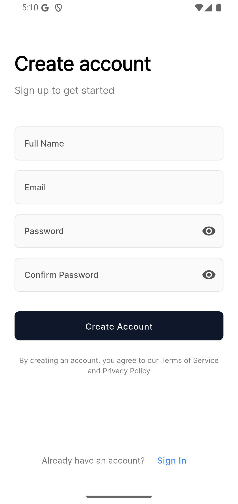
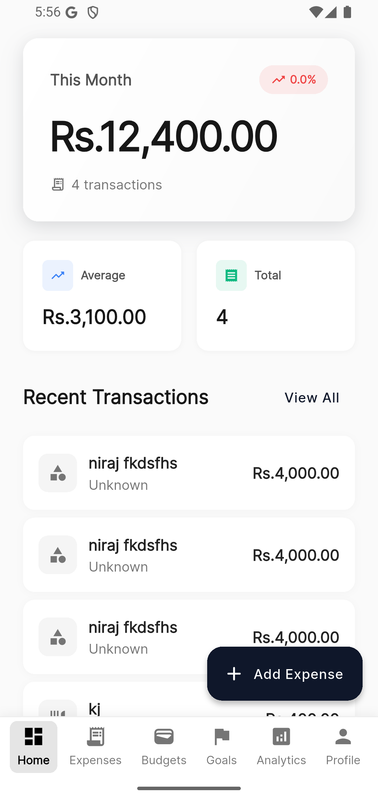
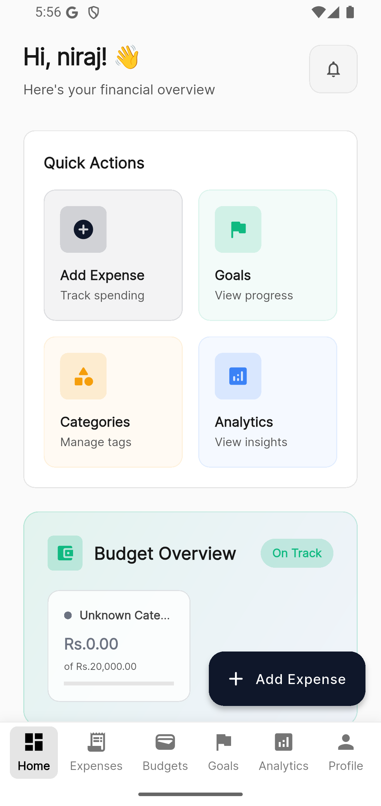
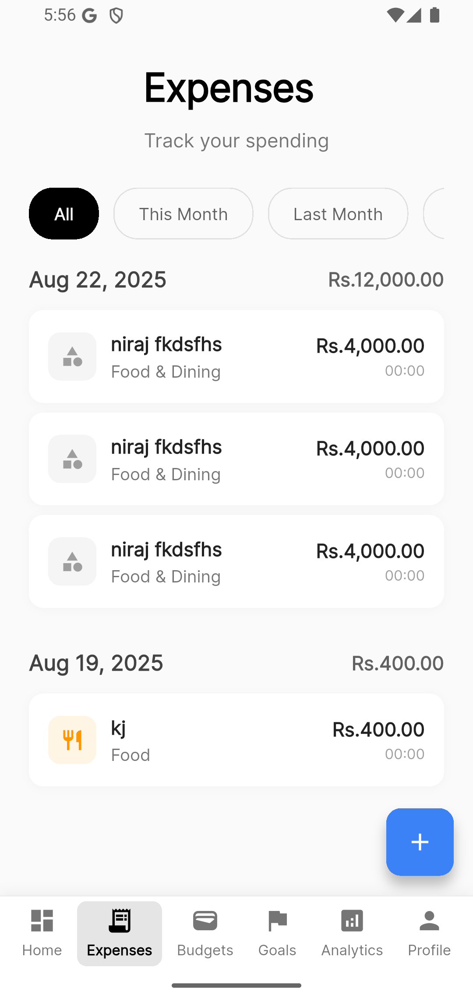
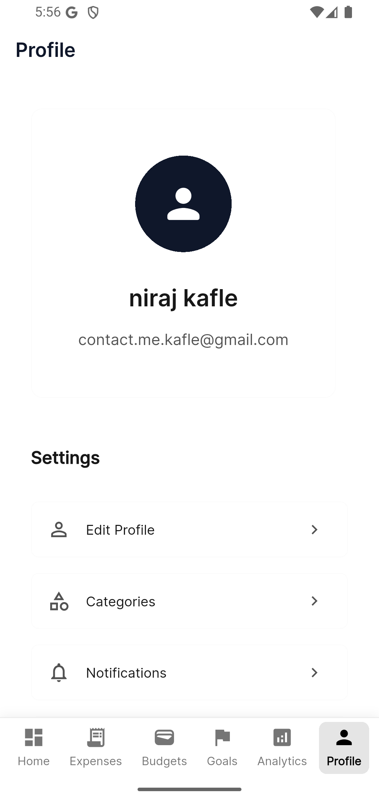
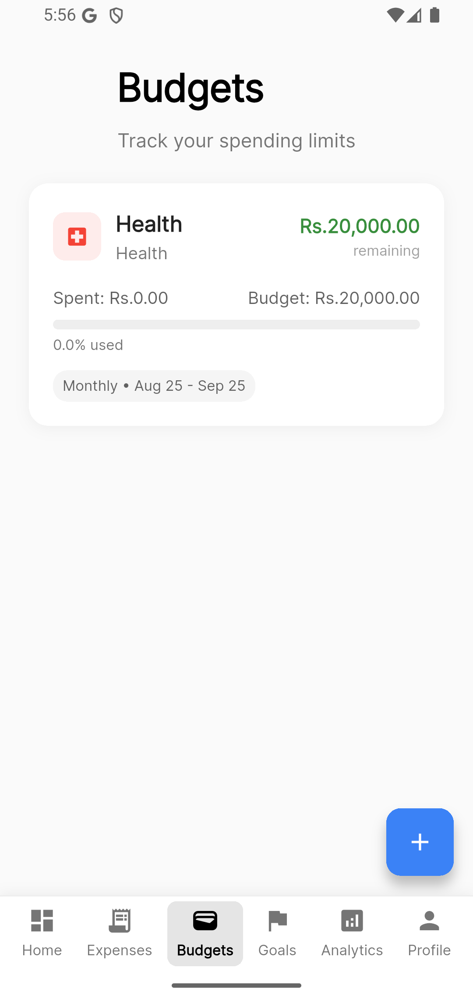
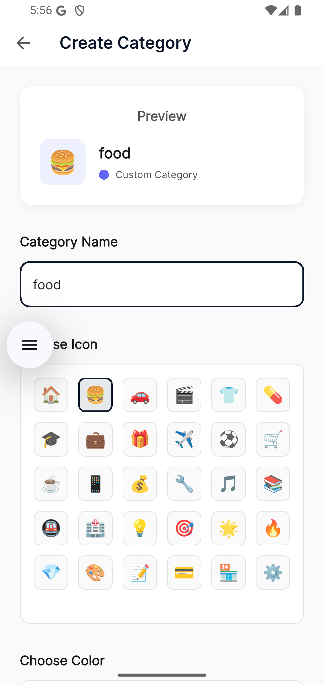

# 💰 Finlytic - Smart Personal Finance Manager

<p align="center">
  
  
  
</p>

**Finlytic** is a comprehensive Flutter-based personal finance management application that combines powerful expense tracking, budget management, and AI-powered insights to help users take control of their financial lives.

## ✨ Features

### 🔐 **Authentication & Security**
- Multi-platform authentication (Email, Google, Phone OTP)
- Biometric authentication for secure access
- Firebase Authentication integration
- Secure local storage with encryption

### 💳 **Smart Expense Tracking**
- **OCR Receipt Scanning** - Snap photos of receipts for automatic data extraction
- **Voice Input** - Add expenses using voice commands with AI-powered parsing
- **Manual Entry** - Traditional form-based expense entry with smart category suggestions
- Real-time expense synchronization across devices
- Offline support with automatic sync when online

### 📊 **Advanced Analytics**
- Interactive charts and visualizations using fl_chart
- Spending trends and patterns analysis
- Category-wise expense breakdown
- Period-based analytics (weekly, monthly, yearly)
- AI-powered financial insights and recommendations

### 🎯 **Budget Management**
- Create and track multiple budgets
- Real-time budget monitoring with alerts
- Period-based budgets (weekly, monthly, quarterly, yearly)
- Visual budget progress indicators
- Smart budget recommendations

### 🏆 **Goals Tracking**
- Set and track financial goals
- Milestone-based progress tracking
- Goal categories (Emergency, Travel, House, etc.)
- Visual progress indicators
- Achievement notifications

### 🏷️ **Category Management**
- Customizable expense categories
- Icon and color customization
- Default and user-defined categories
- Smart category suggestions based on spending patterns

### 📤 **Data Export & Backup**
- Export data in multiple formats (JSON, CSV, PDF)
- Complete backup and restore functionality
- Share financial reports
- Date range filtering for exports

### 🤖 **AI-Powered Features**
- Intelligent expense parsing from text and voice
- Smart category suggestions
- Spending pattern analysis
- Financial insights and recommendations
- OCR text recognition for receipt processing

## 🛠️ Technical Stack

### **Frontend**
- **Flutter** - Cross-platform UI framework
- **Dart** - Programming language
- **Riverpod** - State management
- **Material Design 3** - UI/UX design system

### **Backend & Services**
- **Firebase Authentication** - User management
- **Cloud Firestore** - Real-time database
- **Firebase Storage** - File storage
- **Hive** - Local database for offline support

### **AI & ML**
- **Google ML Kit** - OCR text recognition
- **Speech-to-Text** - Voice input processing
- **OpenRouter API** - AI-powered expense parsing

### **Data Visualization**
- **fl_chart** - Interactive charts
- **Syncfusion Charts** - Advanced visualizations

## 📱 Screenshots

<p align="center">
  
  
  
  
</p>

## 🚀 Getting Started

### Prerequisites
- Flutter SDK (>=3.8.1)
- Dart SDK (>=3.8.1)
- Firebase CLI
- Node.js (>=14.0.0) for PDF generation
- Android Studio / VS Code

### Installation

1. **Clone the repository**
   ```bash
   git clone https://github.com/yourusername/finlytic.git
   cd finlytic
   ```

2. **Install dependencies**
   ```bash
   flutter pub get
   npm install
   ```

3. **Firebase Setup**
   - Create a new Firebase project
   - Enable Authentication, Firestore, and Storage
   - Download and add `google-services.json` (Android) and `GoogleService-Info.plist` (iOS)
   - Update `lib/config/environment_config.dart` with your Firebase configuration

4. **Environment Configuration**
   ```bash
   cp .env.template .env
   # Edit .env with your configuration values
   ```

5. **Code Generation**
   ```bash
   flutter packages pub run build_runner build
   ```

6. **Run the app**
   ```bash
   flutter run
   ```

## 🏗️ Project Structure

```
lib/
├── config/              # Environment configuration
├── models/              # Data models (User, Expense, Budget, etc.)
├── providers/           # Riverpod state providers
├── screens/             # UI screens organized by feature
│   ├── auth/           # Authentication screens
│   ├── dashboard/      # Home dashboard
│   ├── expenses/       # Expense management
│   ├── analytics/      # Charts and analytics
│   ├── budgets/        # Budget management
│   ├── goals/          # Goal tracking
│   └── profile/        # User profile and settings
├── services/           # Business logic services
│   ├── auth_service.dart
│   ├── expense_service.dart
│   ├── ai_service.dart
│   ├── ocr_service.dart
│   └── ...
├── theme/              # App theming and design tokens
├── utils/              # Utility functions and constants
└── widgets/            # Reusable UI components
```

## 🔧 Configuration

### Environment Variables
Create a `.env` file with the following variables:

```env
ENVIRONMENT=development
FIREBASE_PROJECT_ID=your-project-id
FIREBASE_WEB_API_KEY=your-web-api-key
FIREBASE_ANDROID_API_KEY=your-android-api-key
FIREBASE_IOS_API_KEY=your-ios-api-key
# ... additional Firebase config
```

### Firebase Security Rules
Update Firestore security rules to match your authentication requirements:

```javascript
rules_version = '2';
service cloud.firestore {
  match /databases/{database}/documents {
    match /users/{userId} {
      allow read, write: if request.auth != null && request.auth.uid == userId;
    }
    match /expenses/{expenseId} {
      allow read, write: if request.auth != null && resource.data.userId == request.auth.uid;
    }
    // ... additional rules
  }
}
```

## 🌟 Key Features in Detail

### OCR Receipt Scanning
- Capture receipts using camera or gallery
- Automatic extraction of amount, merchant, and date
- Smart category suggestion based on merchant
- Support for multiple receipt formats

### Voice Input
- Natural language expense entry
- AI-powered parsing of voice commands
- Support for amount, description, and category extraction
- Hands-free expense logging

### Advanced Analytics
- Interactive pie charts for spending distribution
- Time-based trend analysis
- Category comparison charts
- Budget vs. actual spending visualization

### Smart Budgeting
- Flexible budget periods (weekly, monthly, yearly)
- Real-time budget tracking
- Alert notifications for budget limits
- Visual progress indicators

## 🔒 Security Features

- **Biometric Authentication** - Fingerprint and face recognition
- **Data Encryption** - Local data encryption using Hive
- **Secure Storage** - Sensitive data stored securely
- **Firebase Security Rules** - Server-side data protection

## 🌐 Offline Support

- **Local Database** - Hive for offline data storage
- **Automatic Sync** - Background synchronization when online
- **Conflict Resolution** - Smart data merging strategies
- **Offline Indicators** - Clear UI feedback for offline state

## 🧪 Testing

```bash
# Run unit tests
flutter test

# Run integration tests
flutter drive --target=test_driver/app.dart
```

## 📦 Building for Production

### Android
```bash
flutter build apk --release
flutter build appbundle --release
```

### iOS
```bash
flutter build ios --release
```

### Web
```bash
flutter build web --release
```

## 🤝 Contributing

1. Fork the repository
2. Create your feature branch (`git checkout -b feature/amazing-feature`)
3. Commit your changes (`git commit -m 'Add some amazing feature'`)
4. Push to the branch (`git push origin feature/amazing-feature`)
5. Open a Pull Request

## 📄 License

This project is licensed under the MIT License - see the [LICENSE](LICENSE) file for details.

## 👥 Authors

- **Niraj Kafle** - *Initial work* - [GitHub Profile](https://github.com/nirajkafle)

## 🙏 Acknowledgments

- Flutter team for the amazing framework
- Firebase team for comprehensive backend services
- Google ML Kit for OCR capabilities
- The open-source community for invaluable packages

## 📞 Support

For support and questions:
- Create an [issue](https://github.com/yourusername/finlytic/issues)
- Email: contact.me.kafle@gmail.com

---

<p align="center">Made with ❤️ using Flutter</p>